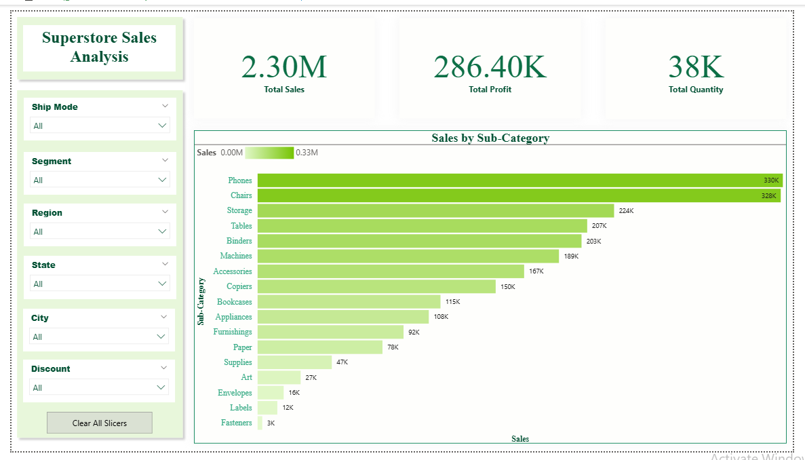

# Superstore Sales Analysis

## Objective
Analyze sales performance to identify key business insights and provide actionable recommendations to improve profitability.

## Tools
- SQLite
- Power BI

## Skills Used
- Data Cleaning
- SQL Aggregation (GROUP BY, JOIN)
- CASE WHEN
- Window Functions (RANK)
- Data Visualization

## Key Analysis
1. Identify the most profitable product categories
2. Analyze the impact of discount on profit
3. Evaluate top-performing regions and cities
4. Detect loss-making products and areas

## Key Insights
- High discount levels significantly reduce profit and may lead to losses
- Technology category generates the highest overall profit
- Some cities generate high sales but relatively low profit
- Certain sub-categories consistently produce negative profit in specific regions

## Recommendations
- Reduce excessive discounts, especially for low-margin products
- Focus on high-performing categories and regions
- Investigate cost structure in high-sales but low-profit areas
- Re-evaluate or optimize loss-making products

## Dataset
Sample Superstore dataset (Kaggle)

## Dashboard Preview

